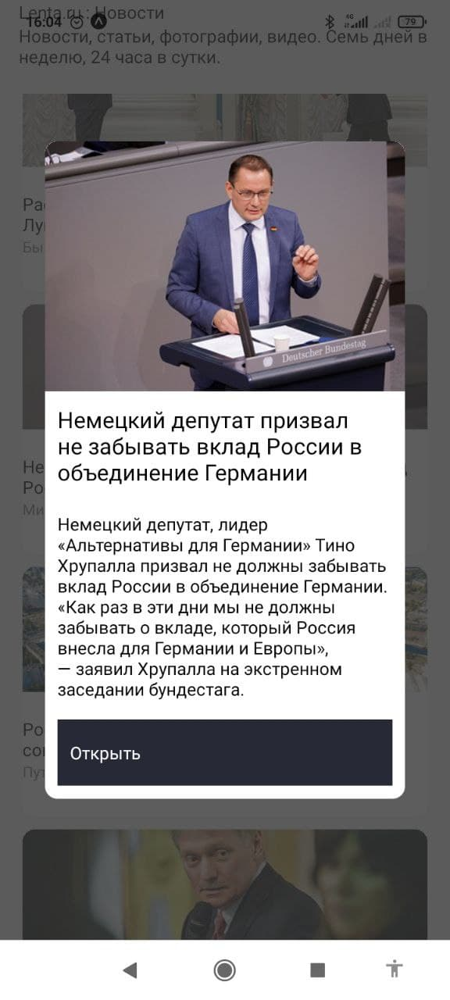

# LENTA.ru новости - мобильное приложение
>Мобильное приложение с парсингом новостей с сайта https://lenta.ru/rss + редирект на веб-сайт с новостью  

## СТЕК: 
- ReactNative
- Axios
- Expo
- rss-to-json

## Установка и запуск:

```
git clone https://github.com/evyz/rss-news-mobile-app.git -b master as rss-mobile
cd rss-mobile
npm install
npm run start
```

## Скриншоты приложения: 

